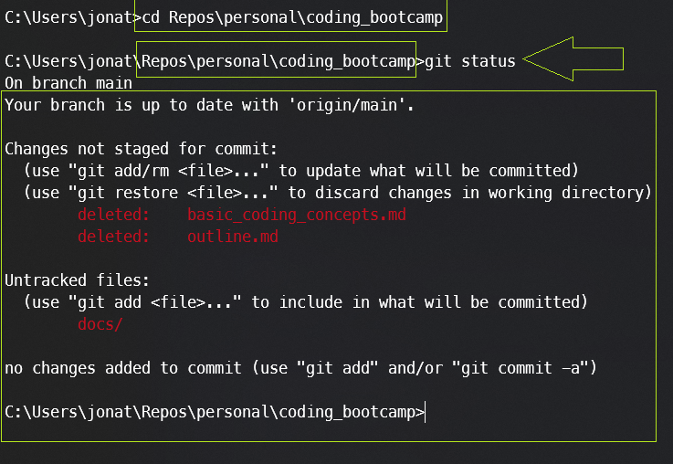

# Git Basics

- [What is Git?](#what-is-git)
- [Basic Git Commands](#basic-git-commands)
- [How to find a Git Directory](#how-to-find-a-git-directory)
- [How to Use Git and GitHub](#how-to-use-git-and-github)


<br>
<br>

# What is Git?
Git is a distributed version control system that helps you track changes in your codebase. It's widely used for collaborative development and managing project history.

<br>
<br>

# Basic Git Commands 

- ## Create a new Git repository

    To start using Git in a project, you initialize a new repository with the git init command. This sets up the necessary structures for version control in your project directory.

    ```bash
    git init
    ```

- ## Clone an existing repository

    To work on an existing project, you clone the repository using git clone <repository_url>. This copies the entire project, including its version history, to your local machine.

    ```bash
    git clone <repository_url>
    ```

- ## Tracking Changes

    Git works by tracking changes. You use git add to stage changes (prepare them for a commit), and then git commit records those changes with a descriptive message.## Checking Status

    ```bash
    ## Add changes to the staging area
    git add <file(s)>

    # Commit changes with a descriptive message
    git commit -m "Your commit message"
    ```


- ## Checking Status

    git status shows you the current state of your working directory. It indicates which files are modified, which changes are staged for the next commit, and more.## Viewing Changes

    ```bash
    # Check the status of your working directory
    git status
    ```

- ## Viewing Changes

    git diff displays the differences between your working directory and the last commit. git log shows a history of commits, including commit messages and identifiers.## Branching


    ```bash
    # Show changes between commits
    git diff

    # Show commit history
    git log

    ```

- ## Branching

    Branching allows you to work on different parts of a project simultaneously. You create a new branch using git branch and switch to it with git checkout.## Merging

    ```bash
    # Create a new branch
    git branch <branch_name>

    # Switch to a branch
    git checkout <branch_name>
    ```

- ## Merging

    Merging combines changes from different branches. After working on a feature branch, you merge it back into the main branch with git merge.## Remote Repositories

    ```bash
    # Merge changes from another branch
    git merge <branch_name>
    ```

- ## Remote Repositories

    Git supports remote repositories (usually hosted on services like GitHub or GitLab). git remote add associates a remote repository, and git push sends your changes to that remote repository.## Pulling Changes

    ```bash
    # Add a remote repository
    git remote add origin <remote_url>

    # Push changes to a remote repository
    git push origin <branch_name>
    ```

- ## Pulling Changes

    To get changes from a remote repository, you use git fetch to download them. git pull combines fetching and merging changes into your local branch.

    ```bash

    # Fetch changes from a remote repository
    git fetch

    # Pull changes into your local branch
    git pull origin <branch_name>

    ```

- ## Resolving Conflicts

    When changes conflict between branches, Git requires manual intervention. git diff helps identify conflicts, and after resolving them, you commit the changes.

    ```bash
    # View conflicted files
    git diff

    # Resolve conflicts and commit
    git commit -m "Merge conflict resolution"
    ```


- ## Undoing Changes

    Mistakes happen, and Git provides ways to undo changes. git checkout -- <file> discards changes in your working directory, and git revert undoes a commit while preserving history.

    ```bash
    # Discard changes in working directory
    git checkout -- <file>

    # Revert commit
    git revert <commit_hash>

    ```

<br>
<br>

# How to find a Git Directory

1. Open your terminal
2. Go to your directory that you cloned using git

    ```
    cd my-repos/coding_bootcamp
    ```

3. Check if you are in the right directory

    You can confirm that the folder is using `git` by running

    ```
    git status
    ```

    If you get a Response -->  then you are good to go.  
    If you get an Error --> Check your directory and make sure you are in a folder that uses `git`

    Like this:

    

    <br>
    <br>

# How to Use Git and GitHub


`NOTE`: if you see things like `<your-repository>`, replace it with the path of your repository (see example above).  


## 1. Create a GitHub Account:

1. Go to GitHub in your web browser.
2. Click on the "Sign up" button and follow the instructions to create a new account.

## 2. Install Git:

- For Linux: Use the terminal or your distribution's package manager.
- For macOS: Use the Terminal app.
- For Windows: Install Git from Git for Windows.  

Verify the installation by typing the following command and pressing Enter:

```
git --version
```

## 3. Configure Git:
Set your username and email address. This information is used for your commits.

```
git config --global user.name "Your Name"  
git config --global user.email "your.email@example.com"
```

## 4. Create a Repository (Optional):
If you already have a repository cloned (like this coding_bootcamp repository), you can skip this step.  
The steps are only provided in case you want to make your own project from scratch

1. Log in to your GitHub account.
2. Click the "+" icon in the top right and select "New repository."
3. Name your repository, provide a description, and click "Create repository."

## 5. Clone the Repository:
In the terminal, navigate to the directory where you want to store your project and run:

``` 
git clone https://github.com/your-username/your-repository.git
Replace your-username with your GitHub username and your-repository with the name of your repository.
```

This will create a new directory with the name of your repository and clone the repository into it.

**Remember**: The github url can be found on github under the green "Code" button.


## 6. Make Changes:

The branch titled `main` is the default branch.  
It is also `LOCKED`. Meaning that you can not make changes to it directly.  
You must create a new branch and make your changes there.  
Then push that branch to GitHub and make a pull request.

   1. Navigate to your local repository in the terminal (see example above):
      - Navigate to your local repository in the terminal:

       ```
       cd <your-repository>
       ```

   2. Create a new branch:


       ```
       git checkout -b 'your-branch-name'
       ```

       This will create a new branch and switch to it.  

       Replace your-branch-name with a meaningful name for your branch (e.g., feature/add-files).  

       Feel free to follow these naming conventions for your branch name but it is not required. 
       - Examples...
         - feature/add-dealer-push
         - bugfix/fix-typos
         - chore/update-readme
         - experiment/add-two-decks-of-cards


   3. Add Files:
      1. Move or create files in the cloned repository directory.  
      2. Use the following commands to add the files:

           ```
           git add .
           ```

           This assumes you want to add all files. If you want to add specific files, replace . with the file names.

   4. Commit Changes:

       Commit the changes with a descriptive message:

       ```
       git commit -m "Add your descriptive message here"
       ```

   5. Push Changes to GitHub:

       ```
       git push origin <your-branch-name>
       ```

## 7.  Create a Pull Request (PR):
   1. Visit your GitHub repository in a web browser. 
   2. You should see a prompt to compare and create a pull request for the branch you just pushed. If not, navigate to the "Pull Requests" tab and click "New pull request."
   3. Set the base branch (usually main or master) and the branch you just created.
   4. Provide a title and description for your pull request.
   5. Click "Create pull request."

## 8. Merge the Pull Request:
   1. Navigate to the "Pull Requests" tab.
   2. Click on the pull request you just created.
   3. Click "Merge pull request."
   4. Confirm the merge.

    You may not have be able to Merge depending on the rules of the branch. It is common for repos to lock down their main branch and require approval before merging.  
    NOTE: There are rules setup for this coding_bootcamp repository on the main branch.  